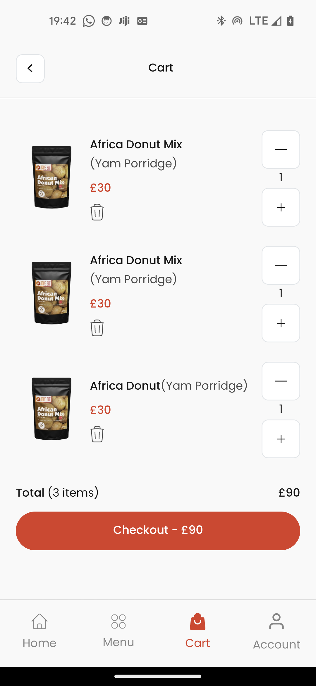

**Assessment Project For Tobams Group Internship Program**

[Video](./assets/images/video_proof.mp4)





>Follow the step to Test in your local machine:

**For Window & Linux Users:**

>Be sure to have all the necessary requirement and setup to build react-native natively. checkout react-native official [docs](https://reactnative.dev/) for more info.

**step 1**
```js
    $git clone https://this_repository
```
**step 2**
```js
    $cd Project_Directory
    $npm install
```

```js
    $ npm start
```


**IOS Users:**
> Repeat Step 1 and 2 above then continue with step 3

**Step 3**
```js
    $pod install
  ```  

```js
    $ npm start
  ``` 

  Depending on the Test time. This project might experience few more improvement but the above step to reproduce will remain unchange.
 
_NB: if you encounter any difficulty running this app, be sure to review your development setup with respect to react-native [official documentation](https://reactnative.dev/docs/environment-setup)

**I Hope we can build more amazing app together again**
